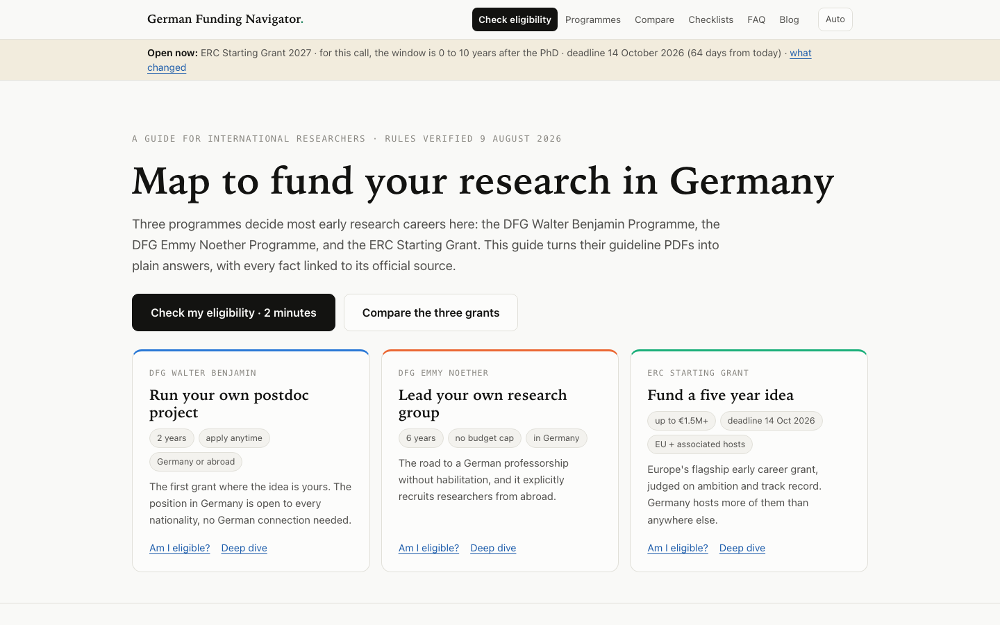

# German Funding Navigator

[](https://jeelswami.github.io/german-funding-navigator/)


[](LICENSE.md)

**Deployed at: [jeelswami.github.io/german-funding-navigator](https://jeelswami.github.io/german-funding-navigator/)**

An interactive guide for international researchers who want to build a research career in Germany, covering three of the most important early career funding routes:

- **DFG Walter Benjamin Programme** (your own postdoc project, in Germany or abroad)
- **DFG Emmy Noether Programme** (your own independent junior research group)
- **ERC Starting Grant** (a major European grant, hosted at a German institution)



## What it does

- **Eligibility navigator**: answer a few questions about your career stage, PhD date, and situation, and see which programmes are realistically open to you right now
- **Deep dives**: what each programme funds, who can apply, how much, how long, and how the decision process works
- **Timelines**: how long each application really takes, from first draft to funded start
- **Checklists**: the documents and commitments each application needs
- **Straight answers**: the questions international researchers actually ask, answered from official sources

## Why I built it

Germany funds research generously, but the system is hard to read from the outside. Programme pages assume you already know how German academia works. This project pulls the official rules into one place, organized around the questions a researcher abroad actually has: am I eligible, from my country, with my PhD date, and what happens next.

Built by [Jeel Swami](https://github.com/JeelSwami), a physicist mapping the German research funding system.

## How to run it locally

It is a static site with no build step. Clone and serve:

```bash
git clone https://github.com/JeelSwami/german-funding-navigator.git
cd german-funding-navigator
python3 -m http.server 4173
```

Then open http://localhost:4173. Or simply open `index.html` in a browser.

## Key technologies

- Plain HTML, CSS and vanilla JavaScript: no frameworks, no build step, no tracking
- The eligibility logic is a hand-written decision tree that encodes the official programme rules, with every fact linked to its source document
- Pages: the navigator (`index.html`), a blog (`blog.html`) and a legal note (`legal.html`), one stylesheet (`styles.css`)

## Sources and credits

All programme facts come from official public sources, credited in full on the site: the Deutsche Forschungsgemeinschaft (DFG), the European Research Council (ERC), the EU Funding and Tenders Portal, and EURAXESS Germany, among others. This is an independent educational project and is not affiliated with or endorsed by any of these organizations. Rules change, so always verify against the official pages before applying.

## Independence

This is a personal, educational project by Jeel Swami. It is not affiliated with, endorsed by, or commissioned by the DFG, the ERC, the European Commission, or any other organization named here. Programme rules change; always confirm details on the official pages before you apply.

## License

Free for study and educational use. Not for commercial use. See [LICENSE.md](LICENSE.md).
